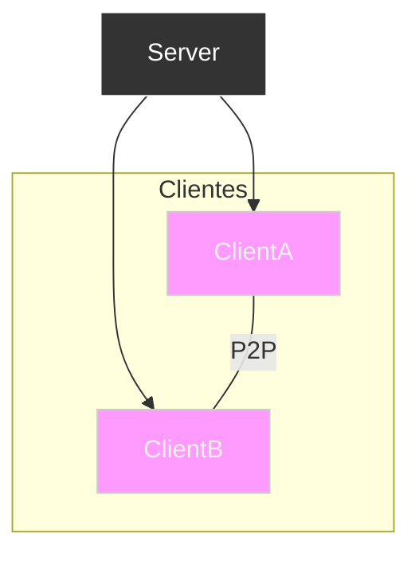

# Hybrid Communication Server  
Hybrid Client-Server + P2P Server

This project implements a server with hybrid communications that combine the traditional model **Client-Server** with a system of **sporadic P2P connections** between clients.
The server handles coordination and authentication, while clients can communicate directly with each other when the application requires it, reducing latency and server load.

## Main features

- **Hybrid Architecture (C/S + P2P)**
  - Centralized server control
  - Optional P2P connections between clients

- **Low Latency**
  - Clients can open direct channels to exchange data.

- **Server as Mediator**
  - Handling signaling, permissions, and authentication.

- **Support for Sporadic Connections**
  - P2P is only established when needed.

- **Modular and Scalable**
  - Easily extendable for chat, gaming, IoT, file transfer, etc.
  
---

##  Arquitecture


1. Clients connect to the server.
2. The server coordinates the communication.
3. If necessary, clients establish a direct P2P channel.
4. If P2P fails, the server acts as a relay.
   
---

## 📥 Installation

```bash
git clone https://github.com/user/Hybrid-CS-P2P-Server.git
cd Hybrid-CS-P2P-Server
